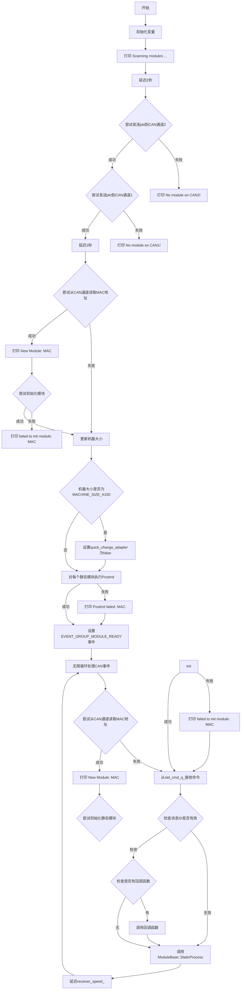

```mermaid
flowchart TD
    A[开始] --> B[初始化变量]
    B --> C[打印 Scanning modules ... ]
    C --> D[延迟2秒]
    D --> E{尝试发送pkt到CAN通道2}
    E -->|失败| F[打印 No module on CAN2! ]
    E -->|成功| G{尝试发送pkt到CAN通道1}
    G -->|失败| H[打印 No module on CAN1! ]
    G -->|成功| I[延迟1秒]
    I --> J{尝试从CAN通道读取MAC地址}
    J -->|失败| K[更新机器大小]
    J -->|成功| L[打印 New Module: MAC ]
    L --> M{尝试初始化模块}
    M -->|失败| N[打印 failed to init module: MAC ]
    M -->|成功| K[更新机器大小]
    K --> O{机器大小是否为MACHINE_SIZE_A150}
    O -->|是| P[设置quick_change_adapter为false]
    O -->|否| Q[对每个静态模块执行PostInit]
    P --> Q[对每个静态模块执行PostInit]
    Q -->|失败| R[打印 PostInit failed: MAC ]
    Q -->|成功| S[设置EVENT_GROUP_MODULE_READY事件]
    R --> S[设置EVENT_GROUP_MODULE_READY事件]
    S --> T[无限循环处理CAN事件]
    T --> U{尝试从CAN通道读取MAC地址}
    U -->|失败| V[从std_cmd_q_接收命令]
    U -->|成功| W[打印 New Module: MAC ]
    W --> X{尝试初始化静态模块}
    init -->|失败| Y[打印 failed to init module: MAC ]
    init -->|成功| V[从std_cmd_q_接收命令]
    Y --> V[从std_cmd_q_接收命令]
    V --> Z{检查消息ID是否有效}
    Z -->|无效| AA[调用ModuleBase::StaticProcess]
    Z -->|有效| AB{检查是否有回调函数}
    AB -->|有| AC[调用回调函数]
    AB -->|无| AA[调用ModuleBase::StaticProcess  ]
    AC --> AA[调用ModuleBase::StaticProcess  ]
    AA --> BB[延迟receiver_speed_]
    BB --> T[无限循环处理CAN事件]
```