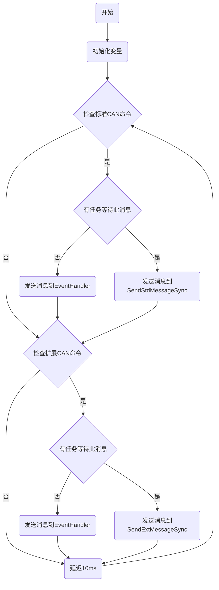

```mermaid
graph TB
    A(开始)
    B(初始化变量)
    C{检查标准CAN命令}
    D{有任务等待此消息}
    E(发送消息到EventHandler)
    F(发送消息到SendStdMessageSync)
    G{检查扩展CAN命令}
    H{有任务等待此消息}
    I(发送消息到EventHandler)
    J(发送消息到SendExtMessageSync)
    K(延迟10ms)
    A --> B
    B --> C
    C -->|是| D
    D -->|否| E
    D -->|是| F
    C -->|否| G
    E --> G
    F --> G
    G -->|是| H
    H -->|否| I
    H -->|是| J
    G -->|否| K
    I --> K
    J --> K
    K --> C
```