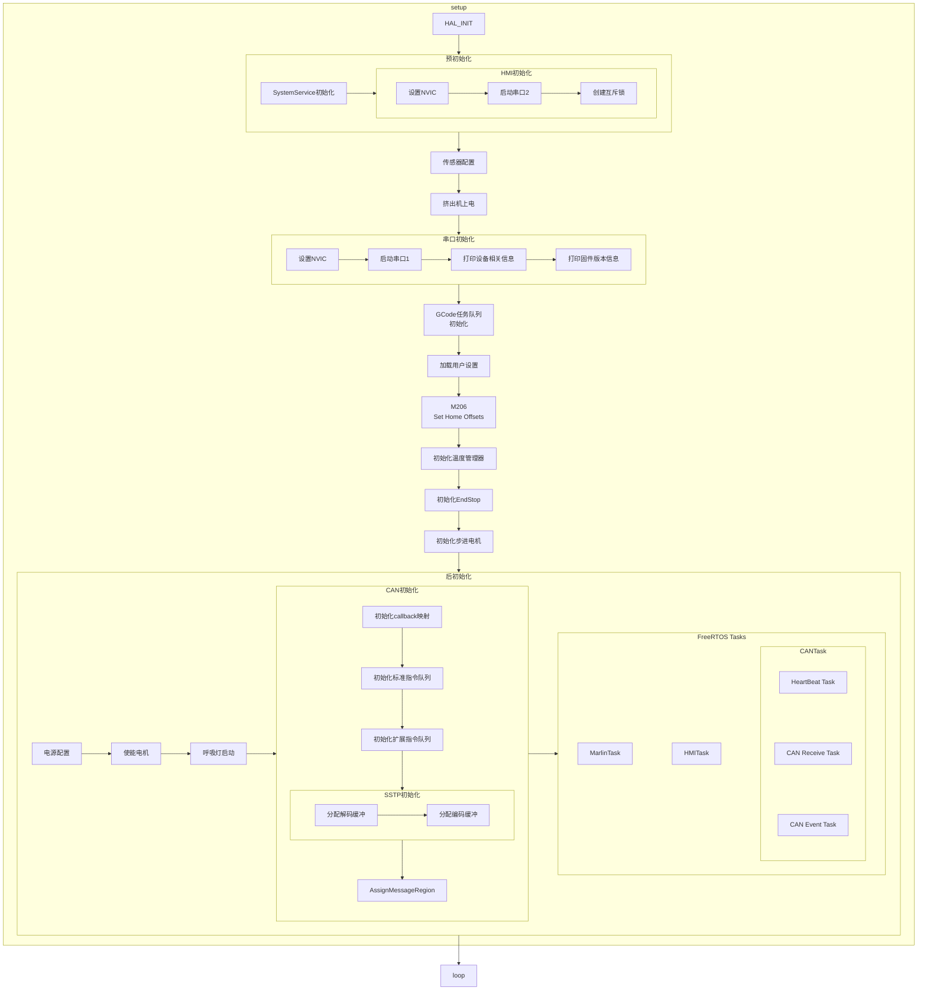

```mermaid
flowchart
    subgraph setup
        direction TB
        HAL_INIT --> setEarly
        setEarly --> runout_setup[传感器配置]
        runout_setup --> e_power[挤出机上电]
        e_power --> 串口初始化 -->GCode任务队列\n初始化 --> load[加载用户设置]
        load-->M206[M206\n Set Home Offsets]
        M206-->初始化温度管理器-->初始化EndStop-->初始化步进电机-->setPost[后初始化]
    end
    
    subgraph 串口初始化
        设置NVIC-->启动串口1-->打印设备相关信息-->打印固件版本信息
    end
    
    subgraph setEarly[预初始化]
        ssInit[SystemService初始化]-->hmiInit[HMI初始化]
    end
    
    subgraph hmiInit[HMI初始化]
        _1[设置NVIC]-->启动串口2-->创建互斥锁
    end
    
    subgraph setPost[后初始化]
        powerInit[电源配置]-->enableMotor[使能电机]-->呼吸灯启动-->canInit[CAN初始化]
        canInit-->taskInit[FreeRTOS\n任务创建]
    end
    
    subgraph canInit[CAN初始化]
        direction TB
        初始化callback映射-->初始化标准指令队列-->初始化扩展指令队列-->sstpInit
        sstpInit-->AssignMessageRegion
    end

    subgraph sstpInit[SSTP初始化]
        分配解码缓冲-->分配编码缓冲
    end
    
    subgraph taskInit[FreeRTOS Tasks]
        MarlinTask~~~HMITask~~~CANTask
    end

    subgraph CANTask
        direction TB
        hb[HeartBeat Task]~~~recv[CAN Receive Task]~~~event[CAN Event Task]
    end
    
    setPost-->loop
    


```