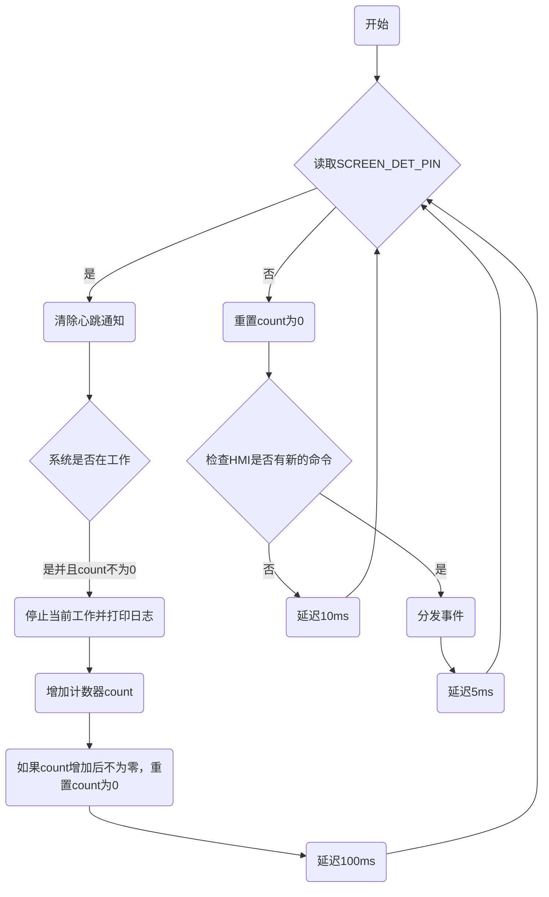

```mermaid
graph TB
    A(开始)
    B{读取SCREEN_DET_PIN}
    C(清除心跳通知)
    D{系统是否在工作}
    E(停止当前工作并打印日志)
    F(增加计数器count)
    G(如果count增加后不为零，重置count为0)
    H(延迟100ms)
    I(重置count为0)
    J{检查HMI是否有新的命令}
    K(延迟10ms)
    L(分发事件)
    M(延迟5ms)
    A --> B
    B -->|是| C
    C --> D
    D -->|是并且count不为0| E
    E --> F
    F --> G
    G --> H
    H --> B
    B -->|否| I
    I --> J
    J -->|否| K
    K --> B
    J -->|是| L
    L --> M
    M --> B
```