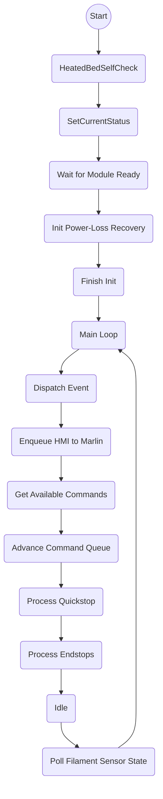

```mermaid
graph TD
A((Start)) --> B(HeatedBedSelfCheck)
B --> C(SetCurrentStatus)
C --> D(Wait for Module Ready)
D --> E(Init Power-Loss Recovery)
E --> F(Finish Init)
F --> G(Main Loop)
G --> H(Dispatch Event)
H --> I(Enqueue HMI to Marlin)
I --> J(Get Available Commands)
J --> K(Advance Command Queue)
K --> L(Process Quickstop)
L --> M(Process Endstops)
M --> N(Idle)
N --> O(Poll Filament Sensor State)
O --> G
```