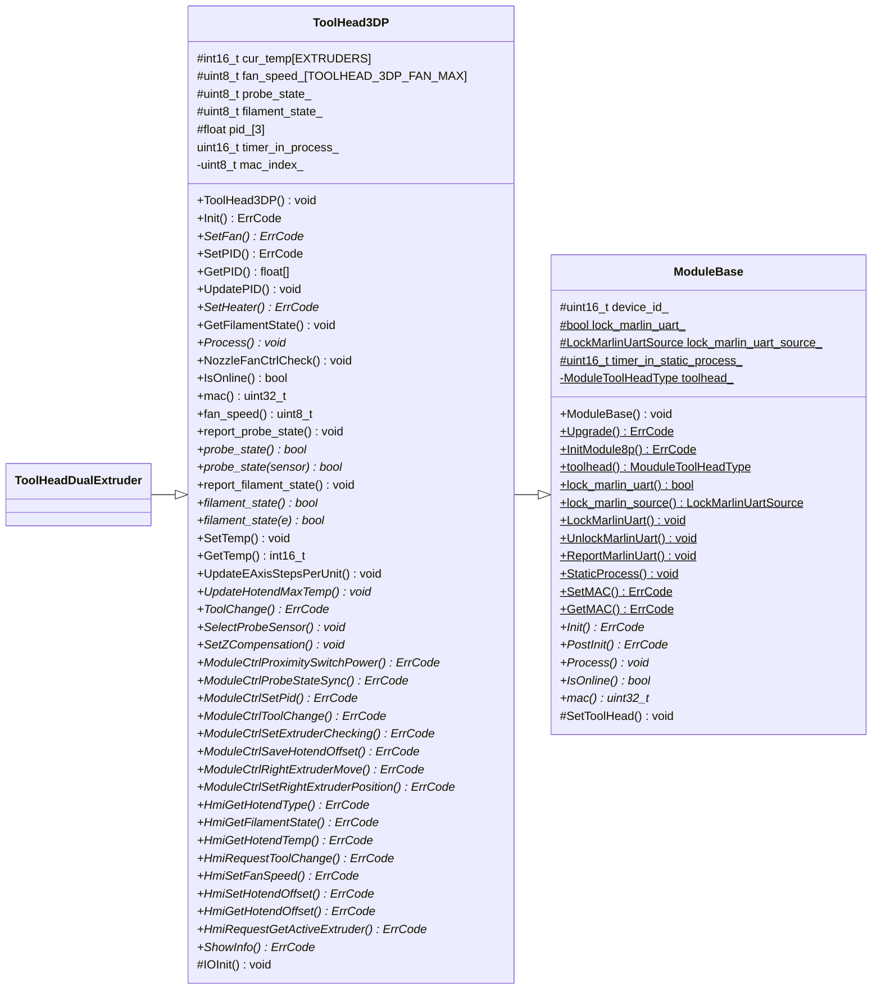

```mermaid

classDiagram
    direction LR
    ToolHead3DP--|>ModuleBase
    
    class ToolHead3DP {
        +ToolHead3DP() void
        +Init() ErrCode
        +SetFan()* ErrCode
        +SetPID() ErrCode
        +GetPID() float[]
        +UpdatePID() void
        
        +SetHeater()* ErrCode
        +GetFilamentState() void
        +Process()* void
        +NozzleFanCtrlCheck() void
        
        +IsOnline() bool
        
        +mac() uint32_t
        
        +fan_speed() uint8_t
        +report_probe_state() void
        +probe_state()* bool
        +probe_state(sensor)* bool
        +report_filament_state() void
        +filament_state()* bool
        +filament_state(e)* bool
        
        +SetTemp() void
        +GetTemp() int16_t
        
        +UpdateEAxisStepsPerUnit() void
        +UpdateHotendMaxTemp()* void
        
        %% all virtual functions for dual extruders
        +ToolChange()* ErrCode
        +SelectProbeSensor()* void
        +SetZCompensation()* void
        %% all return ErrCode below and all virtual functions below
        +ModuleCtrlProximitySwitchPower()* ErrCode
        +ModuleCtrlProbeStateSync()* ErrCode
        +ModuleCtrlSetPid()* ErrCode
        +ModuleCtrlToolChange()* ErrCode
        +ModuleCtrlSetExtruderChecking()* ErrCode
        +ModuleCtrlSaveHotendOffset()* ErrCode
        +ModuleCtrlRightExtruderMove()* ErrCode
        +ModuleCtrlSetRightExtruderPosition()* ErrCode
        +HmiGetHotendType()* ErrCode
        +HmiGetFilamentState()* ErrCode
        +HmiGetHotendTemp()* ErrCode
        +HmiRequestToolChange()* ErrCode
        +HmiSetFanSpeed()* ErrCode
        +HmiSetHotendOffset()* ErrCode
        +HmiGetHotendOffset()* ErrCode
        +HmiRequestGetActiveExtruder()* ErrCode
        +ShowInfo()* ErrCode
        
        #IOInit() void
        #int16_t cur_temp[EXTRUDERS]
        #uint8_t  fan_speed_[TOOLHEAD_3DP_FAN_MAX]
        #uint8_t probe_state_
        #uint8_t filament_state_
        #float pid_[3]
        uint16_t timer_in_process_
        
        -uint8_t mac_index_
        
        
        
    }
    
    class ModuleBase {
         +ModuleBase() void
         +Upgrade()$ ErrCode
         +InitModule8p()$ ErrCode
         +toolhead()$ MouduleToolHeadType
         +lock_marlin_uart()$ bool
         +lock_marlin_source()$ LockMarlinUartSource
         +LockMarlinUart()$ void
         +UnlockMarlinUart()$ void
         +ReportMarlinUart()$ void
         +StaticProcess()$ void
         +SetMAC()$ ErrCode
         +GetMAC()$ ErrCode
         
         +Init()* ErrCode
         +PostInit()* ErrCode
         +Process()* void
         +IsOnline()* bool
         +mac()* uint32_t
         
         #SetToolHead() void
         
         #uint16_t device_id_
         #bool lock_marlin_uart_$
         #LockMarlinUartSource lock_marlin_uart_source_$
         #uint16_t timer_in_static_process_$
         
         -ModuleToolHeadType toolhead_$
    }
    
    ToolHeadDualExtruder --|>ToolHead3DP
    class ToolHeadDualExtruder {
        
    }

```